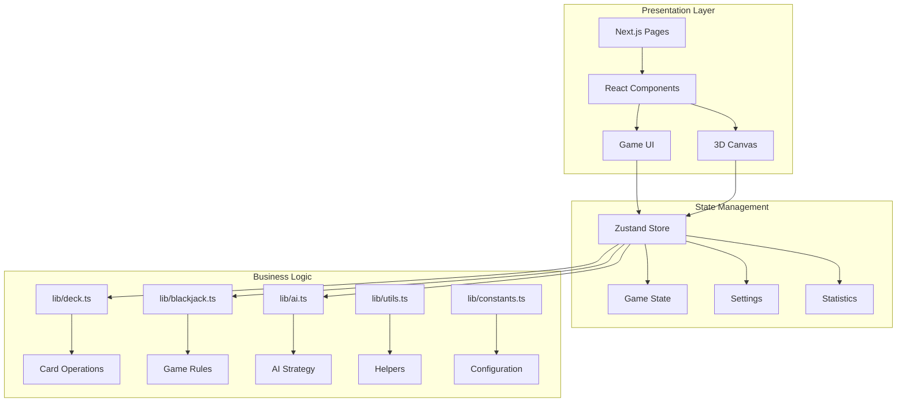

<p align="center">
  
</p>

<h1 align="center">🎰 Blackjack Royale</h1>

<p align="center">
  <strong>A world-class, visually stunning blackjack game built with Next.js 15, React 18, and Three.js</strong>
</p>

<p align="center">
  <a href="https://github.com/dustinthughes/blackjack/actions"></a>
  <a href="https://opensource.org/licenses/Apache-2.0"></a>
  <a href="https://nextjs.org"></a>
  <a href="https://react.dev"></a>
  <a href="https://www.typescriptlang.org"></a>
</p>

<p align="center">
  <a href="https://threejs.org"></a>
  <a href="https://tailwindcss.com"></a>
  <a href="https://www.framer.com/motion/"></a>
  <a href="#"></a>
</p>

<p align="center">
  <a href="#-features">Features</a> •
  <a href="#-quick-start">Quick Start</a> •
  <a href="#-documentation">Documentation</a> •
  <a href="#-architecture">Architecture</a> •
  <a href="#-contributing">Contributing</a> •
  <a href="#-license">License</a>
</p>

---

## 👤 Author

**Dustin T Hughes**

This project was developed by Dustin T Hughes with assistance from [Cursor IDE](https://cursor.sh) - the AI-first code editor.

---

## ✨ Features

<table>
<tr>
<td width="50%">

### 🎮 Immersive Gameplay
- **Multi-player Experience** — Play against 2 AI opponents
- **Authentic Rules** — Full blackjack mechanics with splits, doubles, surrender
- **Smart AI** — Basic strategy-based AI opponents
- **Multi-deck Support** — 1-8 configurable decks

</td>
<td width="50%">

### 🎨 World-Class Visuals
- **Stunning UI** — Gold and green luxury casino theme
- **Smooth Animations** — Framer Motion powered transitions
- **3D Card System** — Three.js rendered playing cards
- **Particle Effects** — Dynamic ambient animations

</td>
</tr>
<tr>
<td width="50%">

### ⚙️ Customizable Settings
- **Deck Count** — 1 to 8 decks in the shoe
- **Dealer Rules** — Hit or stand on soft 17
- **Blackjack Payout** — 3:2 or 6:5 options
- **Animation Speed** — Slow, normal, or fast

</td>
<td width="50%">

### 🛠️ Modern Tech Stack
- **Next.js 15** — App Router with React Server Components
- **TypeScript** — Full type safety throughout
- **Zustand** — Lightweight state management
- **Tailwind CSS** — Utility-first styling

</td>
</tr>
</table>

## 🎲 Game Rules

| Action | Description |
|--------|-------------|
| **Hit** | Draw another card |
| **Stand** | Keep current hand |
| **Double Down** | Double bet, receive one card |
| **Split** | Split pairs into two hands |
| **Surrender** | Forfeit half bet, end hand |
| **Insurance** | Side bet when dealer shows Ace |

> **Blackjack** (Ace + 10-value card) pays **3:2** by default!

## 🚀 Quick Start

### Prerequisites

- **Node.js** 18.17 or later
- **npm** 9.0 or later (or pnpm/yarn)

### Installation

```bash
# Clone the repository
git clone https://github.com/dustinthughes/blackjack.git
cd blackjack

# Install dependencies
npm install

# Start development server
npm run dev
```

Open [http://localhost:3000](http://localhost:3000) in your browser.

### Build for Production

```bash
# Create optimized build
npm run build

# Start production server
npm start
```

## 📖 Documentation

Comprehensive documentation is available in the [`docs/`](docs/) directory:

| Document | Description |
|----------|-------------|
| [📐 Architecture](docs/ARCHITECTURE.md) | System design, component diagrams, data flow |
| [🎮 Game Rules](docs/GAME_RULES.md) | Complete blackjack rules and mechanics |
| [💻 Development](docs/DEVELOPMENT.md) | Setup, coding standards, testing |
| [🔌 API Reference](docs/API.md) | Hooks, utilities, type definitions |
| [🤝 Contributing](docs/CONTRIBUTING.md) | How to contribute to the project |
| [📋 Changelog](docs/CHANGELOG.md) | Version history and release notes |

## 🏗️ Architecture

The codebase follows a clean, modular architecture with clear separation of concerns:



### Project Structure

```
blackjack/
├── 📁 src/
│   ├── 📁 app/                 # Next.js App Router pages
│   │   ├── 📄 page.tsx         # Intro/landing screen
│   │   ├── 📁 game/            # Game page
│   │   └── 📁 settings/        # Settings page
│   ├── 📁 components/          # React components
│   │   ├── 📁 game/            # Game-specific components
│   │   ├── 📁 three/           # Three.js 3D components
│   │   └── 📁 ui/              # Reusable UI components
│   ├── 📁 hooks/               # Custom React hooks
│   │   └── 📄 useBlackjack.ts  # Main game state hook
│   ├── 📁 lib/                 # Core business logic
│   │   ├── 📄 constants.ts     # Application constants
│   │   ├── 📄 utils.ts         # Utility functions
│   │   ├── 📄 deck.ts          # Deck operations
│   │   ├── 📄 blackjack.ts     # Game rules
│   │   ├── 📄 ai.ts            # AI logic
│   │   └── 📄 index.ts         # Module exports
│   ├── 📁 types/               # TypeScript definitions
│   └── 📁 styles/              # Global styles
├── 📁 public/                  # Static assets
│   └── 📁 cards/               # Card SVG images
├── 📁 docs/                    # Documentation
└── 📄 package.json             # Dependencies
```

### Core Modules

| Module | Purpose | Key Exports |
|--------|---------|-------------|
| `lib/constants.ts` | Centralized configuration | `STARTING_CHIPS`, `MIN_BET`, `MAX_BET`, timing configs |
| `lib/utils.ts` | Helper functions | `generateId`, `formatChips`, `clamp`, `delay` |
| `lib/deck.ts` | Card/deck operations | `createDeck`, `shuffleDeck`, `dealCard`, `calculateHandScore` |
| `lib/blackjack.ts` | Game rules | `canHit`, `canSplit`, `determineWinner`, `calculatePayout` |
| `lib/ai.ts` | AI player logic | `getAIDecision`, `getAIBetAmount`, strategy charts |

## 🎨 Design System

### Color Palette

| Color | Hex | Usage |
|-------|-----|-------|
| 🟢 Casino Green | `#2d5a3d` | Primary background |
| 🟡 Gold | `#d4af37` | Accents, highlights |
| ⬛ Rich Black | `#0a0a0a` | Text, shadows |
| ⬜ Cream | `#faf8f0` | Light text |

### Typography

- **Display**: Playfair Display (titles, headings)
- **Body**: Crimson Pro (text, UI elements)

## 🧪 Tech Stack

| Category | Technology |
|----------|------------|
| **Framework** | Next.js 15 (App Router) |
| **Language** | TypeScript 5.6 |
| **UI Library** | React 18.3 |
| **3D Rendering** | Three.js + React Three Fiber |
| **State Management** | Zustand 5.0 |
| **Animations** | Framer Motion 11 |
| **Styling** | Tailwind CSS 3.4 |
| **Icons** | Lucide React |

## 📊 Performance

- ⚡ **Static Generation** — Pre-rendered pages for instant load
- 🖼️ **Optimized Images** — Next.js Image component with lazy loading
- 📦 **Code Splitting** — Automatic route-based code splitting
- 🎯 **Tree Shaking** — Minimal bundle size
- 🔒 **Type Safety** — Full TypeScript coverage, zero `any` types

## 🤝 Contributing

We welcome contributions! Please see our [Contributing Guide](docs/CONTRIBUTING.md) for details.

### Quick Contribution Steps

1. **Fork** the repository
2. **Create** a feature branch (`git checkout -b feature/amazing-feature`)
3. **Commit** your changes (`git commit -m 'Add amazing feature'`)
4. **Push** to the branch (`git push origin feature/amazing-feature`)
5. **Open** a Pull Request

## 📝 Scripts

| Command | Description |
|---------|-------------|
| `npm run dev` | Start development server |
| `npm run build` | Create production build |
| `npm start` | Start production server |
| `npm run lint` | Run ESLint |

## 🐛 Known Issues

See the [Issues](https://github.com/dustinthughes/blackjack/issues) page for current bugs and feature requests.

## 📜 License

This project is licensed under the **Apache License 2.0** — see the [LICENSE](LICENSE) file for details.

```
Copyright 2024 Dustin T Hughes

Licensed under the Apache License, Version 2.0 (the "License");
you may not use this file except in compliance with the License.
You may obtain a copy of the License at

    http://www.apache.org/licenses/LICENSE-2.0
```

## 🙏 Acknowledgments

- **[Cursor IDE](https://cursor.sh)** — AI-powered development assistance
- Card SVG designs from [OpenGameArt](https://opengameart.org)
- Casino felt texture from [FreePik](https://freepik.com)
- Inspired by classic casino games

---

<p align="center">
  Made with ❤️ by <strong>Dustin T Hughes</strong>
</p>

<p align="center">
  ♠️ ♥️ ♦️ ♣️
</p>

<p align="center">
  <a href="#-blackjack-royale">Back to Top ⬆️</a>
</p>
