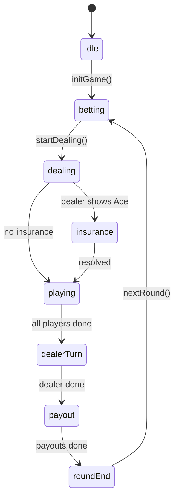

# 🔌 API Reference

Complete reference for all hooks, utilities, and type definitions in Blackjack Royale.

**Author:** Dustin T Hughes  
**Developed with:** [Cursor IDE](https://cursor.sh)

## Table of Contents

- [Module Overview](#module-overview)
- [Constants](#constants)
- [Utilities](#utilities)
- [Deck Operations](#deck-operations)
- [Game Rules](#game-rules)
- [AI Logic](#ai-logic)
- [Hooks](#hooks)
- [Types](#types)

---

## Module Overview

All library code is organized in `src/lib/` and can be imported from the index:

```typescript
// Import from index (recommended)
import { 
  createDeck, 
  shuffleDeck, 
  calculatePayout,
  getAIDecision,
  STARTING_CHIPS 
} from '@/lib';

// Or import from specific modules
import { createDeck } from '@/lib/deck';
import { calculatePayout } from '@/lib/blackjack';
```

---

## Constants

### `lib/constants.ts`

Centralized configuration values. No magic numbers in the codebase.

#### Game Configuration

```typescript
/** Starting chip amount for each player */
export const STARTING_CHIPS = 1000;

/** Minimum bet amount allowed */
export const MIN_BET = 10;

/** Maximum bet amount allowed */
export const MAX_BET = 500;

/** Available chip denominations */
export const CHIP_DENOMINATIONS = [10, 25, 50, 100] as const;

/** Maximum hands per player (after splits) */
export const MAX_HANDS_PER_PLAYER = 4;
```

#### Card Values

```typescript
/** Blackjack score */
export const BLACKJACK_SCORE = 21;

/** Dealer stand threshold */
export const DEALER_STAND_THRESHOLD = 17;

/** Ace values */
export const ACE_HIGH_VALUE = 11;
export const ACE_LOW_VALUE = 1;
```

#### Payout Ratios

```typescript
/** Blackjack payout multiplier (3:2) */
export const BLACKJACK_PAYOUT_3_2 = 1.5;

/** Blackjack payout multiplier (6:5) */
export const BLACKJACK_PAYOUT_6_5 = 1.2;

/** Insurance payout (2:1) */
export const INSURANCE_PAYOUT = 2;
```

#### Animation Timing

```typescript
export const ANIMATION_TIMING = {
  AI_ACTION_DELAY: 500,
  CARD_DEAL: 300,
  CARD_FLIP: 200,
  PHASE_TRANSITION: 100,
} as const;
```

---

## Utilities

### `lib/utils.ts`

Pure utility functions for common operations.

#### ID Generation

```typescript
/**
 * Generates a unique ID using crypto API.
 * @param prefix - Optional prefix for the ID
 */
function generateId(prefix?: string): string
```

#### Array Helpers

```typescript
/**
 * Immutably updates an item by ID.
 */
function updateById<T extends { id: string }>(
  array: T[],
  id: string,
  updater: (item: T) => T
): T[]

/**
 * Finds an item by ID with type safety.
 */
function findById<T extends { id: string }>(
  array: T[],
  id: string
): T | undefined
```

#### Number Utilities

```typescript
/**
 * Clamps a number between min and max.
 */
function clamp(value: number, min: number, max: number): number

/**
 * Rounds to nearest denomination.
 */
function roundToNearest(value: number, denominations: readonly number[]): number
```

#### Formatters

```typescript
/**
 * Formats chip amount with currency symbol.
 */
function formatChips(amount: number): string  // "$1,000"

/**
 * Formats hand score for display.
 */
function formatHandScore(hand: Hand): string  // "Soft 17", "Bust", "Blackjack!"

/**
 * Formats round result.
 */
function formatResult(result: RoundResult): string  // "Win!", "Lose", etc.
```

#### Async Utilities

```typescript
/**
 * Creates a promise that resolves after delay.
 */
function delay(ms: number): Promise<void>

/**
 * Calculates animation delay based on speed.
 */
function getAnimationDelay(
  baseDelay: number,
  speed: 'slow' | 'normal' | 'fast'
): number
```

---

## Deck Operations

### `lib/deck.ts`

Card and deck management functions.

#### Deck Creation

```typescript
/**
 * Creates a multi-deck shoe.
 * @param numberOfDecks - 1 to 8 decks
 * @throws Error if numberOfDecks is invalid
 */
function createDeck(numberOfDecks: number): Card[]

/**
 * Shuffles using Fisher-Yates algorithm.
 * @returns New shuffled array (immutable)
 */
function shuffleDeck(deck: readonly Card[]): Card[]
```

#### Dealing

```typescript
/**
 * Deals a card from the deck.
 * @returns Tuple of [card, remainingDeck]
 * @throws Error if deck is empty
 */
function dealCard(deck: readonly Card[]): [Card, Card[]]

/**
 * Deals multiple cards.
 */
function dealCards(deck: readonly Card[], count: number): [Card[], Card[]]
```

#### Hand Management

```typescript
/**
 * Creates an empty hand.
 */
function createEmptyHand(): Hand

/**
 * Adds a card to hand and updates score.
 */
function addCardToHand(hand: Hand, card: Card, faceUp?: boolean): Hand

/**
 * Calculates optimal hand score.
 * @returns { total: number, isSoft: boolean }
 */
function calculateHandScore(cards: readonly Card[]): ScoreResult
```

#### Hand Analysis

```typescript
/**
 * Checks if hand is a splittable pair.
 */
function isPair(hand: Hand): boolean

/**
 * Gets dealer's visible card.
 */
function getDealerUpcard(dealerHand: Hand): Card | undefined

/**
 * Gets dealer upcard value (0 if none visible).
 */
function getDealerUpcardValue(dealerHand: Hand): number
```

---

## Game Rules

### `lib/blackjack.ts`

Game rules and action validators.

#### Action Validators

```typescript
/**
 * Checks if player can hit.
 */
function canHit(hand: Hand): boolean

/**
 * Checks if player can double down.
 */
function canDoubleDown(
  hand: Hand,
  player: Player,
  settings: Settings,
  isSplitHand?: boolean
): boolean

/**
 * Checks if player can split.
 */
function canSplit(hand: Hand, player: Player): boolean

/**
 * Checks if player can surrender.
 */
function canSurrender(
  hand: Hand,
  player: Player,
  settings: Settings
): boolean
```

#### Dealer Logic

```typescript
/**
 * Determines if dealer should hit.
 */
function dealerShouldHit(dealerHand: Hand, settings: Settings): boolean

/**
 * Checks if insurance should be offered.
 */
function shouldOfferInsurance(dealer: Dealer): boolean
```

#### Result Determination

```typescript
/**
 * Determines winner of a hand.
 */
function determineWinner(
  playerHand: Hand,
  dealerHand: Hand,
  hasSurrendered?: boolean
): RoundResult

/**
 * Calculates payout for a result.
 * @returns Positive for wins, negative for losses
 */
function calculatePayout(
  result: RoundResult,
  bet: number,
  settings: Settings
): number

/**
 * Calculates insurance payout.
 */
function calculateInsurancePayout(
  insuranceBet: number,
  dealerHasBlackjack: boolean
): number
```

#### Available Actions

```typescript
/**
 * Gets all available actions for a player.
 */
function getAvailableActions(
  player: Player,
  settings: Settings
): AvailableAction[]  // ['hit', 'stand', 'double', ...]
```

---

## AI Logic

### `lib/ai.ts`

AI decision making using basic strategy.

#### Decision Making

```typescript
/**
 * Gets AI decision using basic strategy charts.
 */
function getAIDecision(
  hand: Hand,
  dealer: Dealer,
  settings: Settings,
  canDoubleDown: boolean,
  canSplitHand: boolean,
  canSurrenderHand: boolean
): PlayerAction
```

#### Betting

```typescript
/**
 * Gets AI bet amount (conservative 5% of chips).
 */
function getAIBetAmount(
  chips: number,
  minBet: number,
  maxBet: number
): number
```

#### Insurance

```typescript
/**
 * Determines if AI should buy insurance.
 * @returns Always false (basic strategy)
 */
function shouldAIBuyInsurance(): boolean
```

---

## Hooks

### `useBlackjack`

Main game state hook powered by Zustand.

```typescript
import { useBlackjack } from '@/hooks/useBlackjack';

function GameComponent() {
  const {
    // State
    players,
    dealer,
    deck,
    phase,
    currentPlayerIndex,
    roundNumber,
    settings,
    stats,
    
    // Actions
    initGame,
    placeBet,
    startDealing,
    hit,
    stand,
    doubleDown,
    split,
    surrender,
    nextRound,
    updateSettings,
  } = useBlackjack();
}
```

### `useSettings`

Convenience hook for settings.

```typescript
import { useSettings } from '@/hooks/useBlackjack';

function SettingsComponent() {
  const { settings, updateSettings } = useSettings();
}
```

### `useStats`

Convenience hook for statistics.

```typescript
import { useStats } from '@/hooks/useBlackjack';

function StatsComponent() {
  const stats = useStats();
}
```

---

## Types

### Core Types

```typescript
// Card
type Suit = 'hearts' | 'diamonds' | 'clubs' | 'spades';
type Rank = 'ace' | '2' | ... | 'king';

interface Card {
  readonly id: string;
  readonly suit: Suit;
  readonly rank: Rank;
  readonly value: number;
  readonly imagePath: string;
  faceUp: boolean;
}

// Hand
interface Hand {
  readonly cards: Card[];
  readonly score: number;
  readonly isBusted: boolean;
  readonly isBlackjack: boolean;
  readonly isSoft: boolean;
}

// Player
type PlayerType = 'user' | 'ai';
type PlayerAction = 'hit' | 'stand' | 'double' | 'split' | 'surrender' | 'insurance';
type RoundResult = 'win' | 'lose' | 'push' | 'blackjack' | 'surrender' | 'pending';

interface Player {
  readonly id: string;
  readonly name: string;
  readonly type: PlayerType;
  readonly position: number;
  hands: Hand[];
  activeHandIndex: number;
  chips: number;
  bets: number[];
  // ... more properties
}
```

### Settings Type

```typescript
type AnimationSpeed = 'slow' | 'normal' | 'fast';
type BlackjackPayout = '3:2' | '6:5';

interface Settings {
  readonly numberOfDecks: number;        // 1-8
  readonly dealerHitsSoft17: boolean;
  readonly blackjackPays: BlackjackPayout;
  readonly allowSurrender: boolean;
  readonly allowDoubleAfterSplit: boolean;
  readonly animationSpeed: AnimationSpeed;
}
```

### Game State Type

```typescript
type GamePhase = 
  | 'idle' | 'betting' | 'dealing' | 'insurance'
  | 'playing' | 'dealer-turn' | 'payout' | 'round-end';

interface GameState {
  readonly players: Player[];
  readonly dealer: Dealer;
  readonly deck: Card[];
  readonly currentPlayerIndex: number;
  readonly phase: GamePhase;
  readonly roundNumber: number;
  readonly settings: Settings;
  readonly stats: SessionStats;
}
```

---

## State Flow



---

<p align="center">
  <a href="../README.md">← Back to README</a>
</p>
