# 📐 Architecture

This document describes the architecture of Blackjack Royale, including system design, component relationships, and data flow patterns.

**Author:** Dustin T Hughes  
**Developed with:** [Cursor IDE](https://cursor.sh)

## Table of Contents

- [Overview](#overview)
- [System Architecture](#system-architecture)
- [Module Structure](#module-structure)
- [State Management](#state-management)
- [Data Flow](#data-flow)
- [Game Logic](#game-logic)
- [Rendering Pipeline](#rendering-pipeline)

---

## Overview

Blackjack Royale is built on a modern React architecture using Next.js 15's App Router. The application follows a clean, modular design with:

- **Centralized Constants** — All magic numbers and configuration in `lib/constants.ts`
- **Pure Utility Functions** — Reusable helpers in `lib/utils.ts`
- **Separated Business Logic** — Game rules, deck operations, and AI in dedicated modules
- **Type Safety** — Full TypeScript coverage with strict mode enabled

### Key Architectural Decisions

| Decision | Rationale |
|----------|-----------|
| **Next.js App Router** | Server-side rendering, file-based routing, React Server Components |
| **Zustand for State** | Lightweight, TypeScript-friendly, no boilerplate, persistence support |
| **Modular Lib Structure** | Clear separation of concerns, easy testing, reusable logic |
| **Centralized Constants** | No magic numbers, single source of truth for configuration |

---

## System Architecture


---

## Module Structure

### Core Library Modules (`src/lib/`)


### Module Responsibilities

| Module | Responsibility | Key Exports |
|--------|---------------|-------------|
| **constants.ts** | Application-wide constants, configuration values | `STARTING_CHIPS`, `MIN_BET`, `MAX_BET`, `ANIMATION_TIMING`, `BLACKJACK_SCORE` |
| **utils.ts** | Pure utility functions, formatters, type guards | `generateId`, `clamp`, `formatChips`, `updateById`, `delay` |
| **deck.ts** | Card and deck operations, hand scoring | `createDeck`, `shuffleDeck`, `dealCard`, `calculateHandScore`, `addCardToHand` |
| **blackjack.ts** | Game rules, action validators, payouts | `canHit`, `canSplit`, `determineWinner`, `calculatePayout`, `getAvailableActions` |
| **ai.ts** | AI decision making using basic strategy | `getAIDecision`, `getAIBetAmount`, `shouldAIBuyInsurance` |
| **index.ts** | Centralized exports for clean imports | Re-exports all public APIs |

---

## State Management

### Zustand Store Structure


### Store Slices

```typescript
interface GameState {
  // Core Game State
  players: Player[];           // All players (excluding dealer)
  dealer: Dealer;              // Dealer's hand and state
  deck: Card[];                // Current shoe (remaining cards)
  phase: GamePhase;            // Current game phase
  currentPlayerIndex: number;  // Active player's turn
  roundNumber: number;         // Current round count
  
  // Configuration
  settings: Settings;          // Game rules configuration
  
  // Statistics
  stats: SessionStats;         // Win/loss tracking
}
```

### State Updates Pattern

All state updates follow an immutable pattern:

```typescript
// ✅ Correct - Immutable update
set({
  players: players.map(p => 
    p.id === playerId 
      ? { ...p, chips: p.chips + amount }
      : p
  )
});

// Using utility function
set({
  players: updateById(players, playerId, p => ({
    ...p,
    chips: p.chips + amount
  }))
});
```

---

## Data Flow

### Unidirectional Data Flow


### Action Flow Example: Hit


---

## Game Logic

### Deck Operations Flow

```mermaid
flowchart TD
    A[Create Deck] --> B{Number of Decks}
    B --> C[Generate 52 × N Cards]
    C --> D[Fisher-Yates Shuffle]
    D --> E[Ready for Play]
    
    E --> F{Deal Card}
    F --> G[Pop from Deck]
    G --> H{Deck < 25%?}
    H -->|Yes| I[Create & Shuffle New Deck]
    H -->|No| J[Continue]
    I --> J
    J --> E
```



### Hand Scoring Algorithm


### AI Decision Flow


---

## Rendering Pipeline

### Component Hierarchy


### Animation Timeline (Card Deal)


---

## Performance Considerations

### Optimization Strategies

| Strategy | Implementation |
|----------|----------------|
| **Memoization** | `useMemo` for expensive calculations, `useCallback` for handlers |
| **Lazy Loading** | Dynamic imports for 3D components with `ssr: false` |
| **Image Optimization** | Next.js Image with proper sizing and priority hints |
| **State Selectors** | Zustand `useShallow` for partial state subscriptions |
| **Pure Functions** | All lib functions are pure, enabling caching |

### Bundle Composition


---

## Error Handling

### Error Boundary Strategy


---

## Security Considerations

- **Client-side only** — No server-side game logic, no cheating concerns
- **Local storage** — Settings and stats persisted locally
- **No real money** — Educational/entertainment purpose only
- **Input validation** — All user inputs validated before state updates

---

## Future Architecture Considerations

1. **Multiplayer Support** — WebSocket integration for real-time play
2. **Backend Services** — User accounts, leaderboards, cloud saves
3. **Mobile Apps** — React Native with shared business logic
4. **Progressive Web App** — Offline support, installability

---

<p align="center">
  <a href="../README.md">← Back to README</a>
</p>
