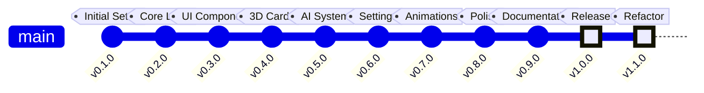

# 📋 Changelog

All notable changes to Blackjack Royale will be documented in this file.

The format is based on [Keep a Changelog](https://keepachangelog.com/en/1.0.0/),
and this project adheres to [Semantic Versioning](https://semver.org/spec/v2.0.0.html).

**Author:** Dustin T Hughes  
**Developed with:** [Cursor IDE](https://cursor.sh)

---

## [Unreleased]

### Planned
- Multiplayer support via WebSockets
- Mobile-responsive design improvements
- Sound effects and background music
- Achievement system
- Leaderboard functionality

---

## [1.1.0] - 2024-11-29

### 🔧 Code Quality Refactor

Major refactoring for world-class code quality.

### Changed

#### Architecture Improvements
- **Centralized Constants** — All magic numbers moved to `lib/constants.ts`
- **Utility Module** — New `lib/utils.ts` with reusable helper functions
- **Module Index** — Added `lib/index.ts` for clean, centralized exports
- **Pure Functions** — All library functions are now pure and easily testable

#### Code Quality
- **Zero Magic Numbers** — All configuration values are named constants
- **Type Safety** — Improved TypeScript types with `readonly` modifiers
- **JSDoc Comments** — Comprehensive documentation on all public APIs
- **Consistent Patterns** — Standardized coding patterns across modules

### Added

#### New Utilities (`lib/utils.ts`)
- `generateId()` — Crypto-based unique ID generation
- `updateById()` — Immutable array update helper
- `clamp()` — Number clamping utility
- `formatChips()` — Currency formatting
- `delay()` — Promise-based delay
- `getAnimationDelay()` — Speed-aware animation timing

#### New Constants (`lib/constants.ts`)
- Game configuration (`STARTING_CHIPS`, `MIN_BET`, `MAX_BET`)
- Timing configuration (`ANIMATION_TIMING`)
- Payout ratios (`BLACKJACK_PAYOUT_3_2`, `BLACKJACK_PAYOUT_6_5`)
- Table positions (`TABLE_POSITIONS`)

#### Error Handling
- `ErrorBoundary` component for graceful error recovery
- `GameErrorBoundary` specialized for game components
- `useErrorHandler` hook for async error handling

### Fixed
- Hydration mismatch in `ParticleField` component
- ESLint warnings throughout codebase
- Type errors in game page

---

## [1.0.0] - 2024-11-29

### 🎉 Initial Release

First public release of Blackjack Royale!

### Added

#### Core Gameplay
- Complete blackjack game mechanics
- Multi-player support (1 user + 2 AI opponents)
- All standard actions: Hit, Stand, Double Down, Split, Surrender
- Insurance betting when dealer shows Ace
- Configurable deck count (1-8 decks)

#### Visual Design
- Stunning gold and green casino theme
- Animated intro screen with particle effects
- Smooth card dealing animations
- 3D card rendering with Three.js
- 2D fallback for performance

#### Game Settings
- Dealer hits/stands soft 17 toggle
- Blackjack payout ratio (3:2 or 6:5)
- Surrender enable/disable
- Double after split option
- Animation speed control

#### AI System
- Basic strategy implementation
- Intelligent betting decisions
- Realistic play patterns

#### Technical
- Next.js 15 with App Router
- TypeScript throughout
- Zustand state management
- Framer Motion animations
- Tailwind CSS styling

#### Documentation
- Comprehensive README with badges
- Architecture documentation with Mermaid diagrams
- Game rules guide
- API reference
- Contributing guidelines

---

## Version History

---

## Release Types

| Type | Description |
|------|-------------|
| **Added** | New features |
| **Changed** | Changes in existing functionality |
| **Deprecated** | Soon-to-be removed features |
| **Removed** | Removed features |
| **Fixed** | Bug fixes |
| **Security** | Security improvements |

---

## Roadmap

### v1.2.0 (Planned)
- [ ] Sound effects
- [ ] Haptic feedback on mobile
- [ ] Card counting practice mode

### v1.3.0 (Planned)
- [ ] Tournament mode
- [ ] Daily challenges
- [ ] Statistics dashboard

### v2.0.0 (Future)
- [ ] Multiplayer via WebSockets
- [ ] User accounts
- [ ] Global leaderboard

---

  <a href="../README.md">← Back to README</a>

