# 🤝 Contributing Guide

Thank you for your interest in contributing to Blackjack Royale! This document provides guidelines and instructions for contributing.

**Author:** Dustin T Hughes  
**Developed with:** [Cursor IDE](https://cursor.sh)

## Table of Contents

- [Code of Conduct](#code-of-conduct)
- [How to Contribute](#how-to-contribute)
- [Development Setup](#development-setup)
- [Pull Request Process](#pull-request-process)
- [Coding Standards](#coding-standards)
- [Issue Guidelines](#issue-guidelines)
- [Community](#community)

---

## Code of Conduct

### Our Pledge

We are committed to providing a friendly, safe, and welcoming environment for all contributors.

### Expected Behavior

- Be respectful and inclusive
- Provide constructive feedback
- Accept criticism gracefully
- Focus on what's best for the community

### Unacceptable Behavior

- Harassment or discrimination
- Trolling or insulting comments
- Personal attacks
- Publishing private information

---

## How to Contribute

### Types of Contributions

```mermaid
flowchart LR
    A[Contribution Types] --> B[🐛 Bug Reports]
    A --> C[✨ Feature Requests]
    A --> D[📖 Documentation]
    A --> E[💻 Code]
    A --> F[🎨 Design]
    A --> G[🧪 Testing]
```



| Type | Description |
|------|-------------|
| **Bug Reports** | Found a bug? Report it! |
| **Feature Requests** | Have an idea? Share it! |
| **Documentation** | Improve docs, fix typos |
| **Code** | Fix bugs, add features |
| **Design** | UI/UX improvements |
| **Testing** | Write tests, find edge cases |

### First-Time Contributors

New to open source? Look for issues labeled:

- `good first issue` — Great for beginners
- `help wanted` — Extra attention needed
- `documentation` — No code required

---

## Development Setup

### Prerequisites

- Node.js 18.17+
- npm 9.0+
- Git

### Setup Steps

```bash
# 1. Fork the repository on GitHub

# 2. Clone your fork
git clone https://github.com/YOUR-USERNAME/blackjack.git
cd blackjack

# 3. Add upstream remote
git remote add upstream https://github.com/ORIGINAL-OWNER/blackjack.git

# 4. Install dependencies
npm install

# 5. Create a branch
git checkout -b feature/your-feature-name

# 6. Start development server
npm run dev
```

### Setup Diagram


---

## Pull Request Process

### Before Submitting

- [ ] Code compiles without errors
- [ ] All tests pass
- [ ] Linting passes (`npm run lint`)
- [ ] Documentation updated (if needed)
- [ ] Commit messages follow conventions

### PR Workflow


### PR Template

When opening a PR, use this template:

```markdown
## Description
Brief description of changes

## Type of Change
- [ ] Bug fix
- [ ] New feature
- [ ] Documentation
- [ ] Refactoring

## Testing
How did you test these changes?

## Screenshots
If applicable, add screenshots

## Checklist
- [ ] Code follows style guidelines
- [ ] Tests added/updated
- [ ] Documentation updated
```

### Review Process

1. **Automated Checks** — CI runs tests and linting
2. **Code Review** — Maintainer reviews changes
3. **Feedback** — Address any requested changes
4. **Approval** — Maintainer approves PR
5. **Merge** — Changes merged to main

---

## Coding Standards

### TypeScript

```typescript
// ✅ Use explicit types
function calculateScore(cards: Card[]): number {
  return cards.reduce((sum, card) => sum + card.value, 0);
}

// ❌ Avoid 'any'
function process(data: any) { /* ... */ }
```

### React Components

```tsx
// ✅ Use functional components with proper types
interface CardProps {
  card: Card;
  faceUp: boolean;
}

export function Card({ card, faceUp }: CardProps) {
  return <div>{/* ... */}</div>;
}

// ✅ Add JSDoc comments for public components
/**
 * Displays a playing card.
 * @param card - The card data
 * @param faceUp - Whether card is visible
 */
```

### File Structure

```
src/
├── components/
│   └── ComponentName/
│       ├── ComponentName.tsx    # Main component
│       ├── ComponentName.test.tsx
│       └── index.ts             # Export
```

### Commit Messages

Follow [Conventional Commits](https://www.conventionalcommits.org/):

```
<type>(<scope>): <description>

[optional body]

[optional footer]
```

| Type | Usage |
|------|-------|
| `feat` | New feature |
| `fix` | Bug fix |
| `docs` | Documentation |
| `style` | Formatting |
| `refactor` | Code restructuring |
| `test` | Adding tests |
| `chore` | Maintenance |

**Examples:**

```bash
feat(game): add split hand functionality
fix(cards): correct ace value calculation  
docs(readme): update installation steps
```

---

## Issue Guidelines

### Bug Reports

When reporting a bug, include:

```markdown
## Bug Description
Clear description of the bug

## Steps to Reproduce
1. Go to '...'
2. Click on '...'
3. See error

## Expected Behavior
What should happen

## Actual Behavior
What actually happens

## Environment
- OS: [e.g., macOS 14]
- Browser: [e.g., Chrome 120]
- Node version: [e.g., 18.17]

## Screenshots
If applicable
```

### Feature Requests

When requesting a feature:

```markdown
## Feature Description
Clear description of the feature

## Use Case
Why is this feature needed?

## Proposed Solution
How might this work?

## Alternatives Considered
Other approaches you've thought of

## Additional Context
Any other information
```

### Issue Labels

| Label | Description |
|-------|-------------|
| `bug` | Something isn't working |
| `enhancement` | New feature or improvement |
| `documentation` | Documentation updates |
| `good first issue` | Good for newcomers |
| `help wanted` | Extra attention needed |
| `wontfix` | Won't be worked on |
| `duplicate` | Already exists |

---

## Community

### Getting Help

- **GitHub Issues** — For bugs and features
- **Discussions** — For questions and ideas

### Recognition

Contributors are recognized in:

- README.md Contributors section
- Release notes
- GitHub contributor graph

### Maintainers

Current maintainers:

| Name | Role | Contact |
|------|------|---------|
| Project Lead | Core development | @username |

---

## License

By contributing, you agree that your contributions will be licensed under the [Apache License 2.0](../LICENSE).

```
Copyright 2024 Blackjack Royale Contributors

Licensed under the Apache License, Version 2.0
```

---

## Thank You! 🙏

Every contribution, no matter how small, makes a difference. Thank you for helping make Blackjack Royale better!

<p align="center">
  <a href="../README.md">← Back to README</a>
</p>

