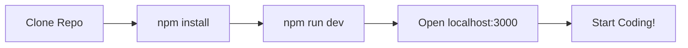
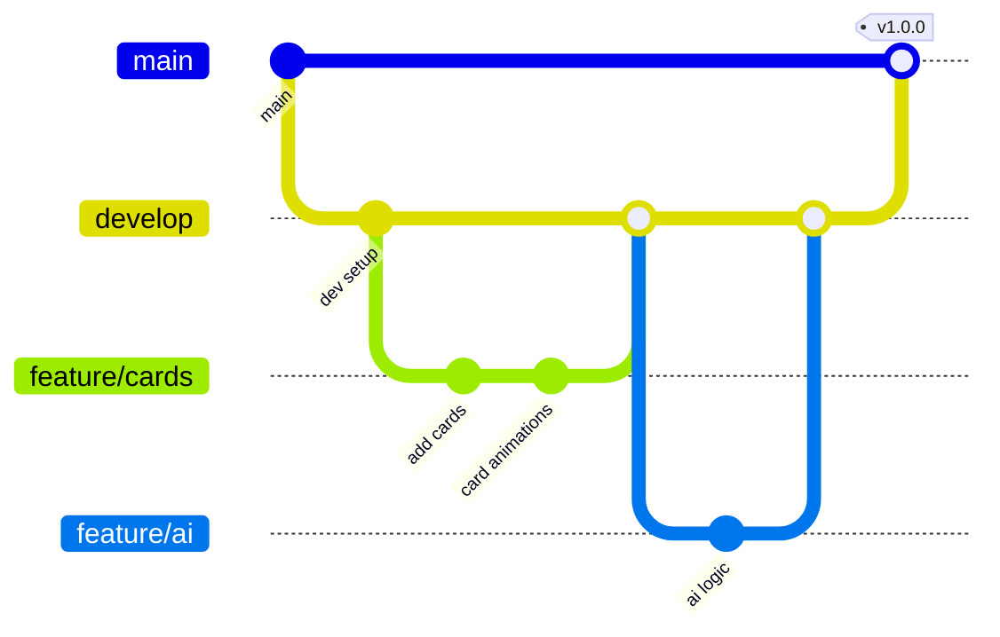
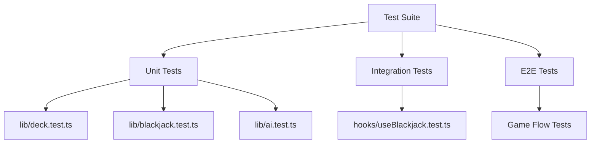
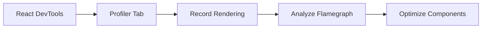

# 💻 Development Guide

Complete guide for setting up your development environment and contributing to Blackjack Royale.

**Author:** Dustin T Hughes  
**Developed with:** [Cursor IDE](https://cursor.sh)

## Table of Contents

- [Prerequisites](#prerequisites)
- [Quick Setup](#quick-setup)
- [Development Workflow](#development-workflow)
- [Project Structure](#project-structure)
- [Coding Standards](#coding-standards)
- [Testing](#testing)
- [Building](#building)
- [Troubleshooting](#troubleshooting)

---

## Prerequisites

### Required Software

| Software | Version | Purpose |
|----------|---------|---------|
| **Node.js** | 18.17+ | JavaScript runtime |
| **npm** | 9.0+ | Package manager |
| **Git** | Latest | Version control |

### Recommended Tools

| Tool | Purpose |
|------|---------|
| **VS Code** | Code editor with great TypeScript support |
| **React DevTools** | Browser extension for debugging |
| **ESLint Extension** | Real-time linting in editor |

---

## Quick Setup

### 1. Clone the Repository

```bash
git clone https://github.com/your-username/blackjack.git
cd blackjack
```

### 2. Install Dependencies

```bash
npm install
```

### 3. Start Development Server

```bash
npm run dev
```

The app will be available at [http://localhost:3000](http://localhost:3000).

### Setup Flowchart



---

## Development Workflow

### Branch Strategy



| Branch | Purpose |
|--------|---------|
| `main` | Production-ready code |
| `develop` | Integration branch |
| `feature/*` | New features |
| `fix/*` | Bug fixes |
| `docs/*` | Documentation updates |

### Commit Convention

Follow [Conventional Commits](https://www.conventionalcommits.org/):

```
<type>(<scope>): <description>

[optional body]

[optional footer]
```

| Type | Description |
|------|-------------|
| `feat` | New feature |
| `fix` | Bug fix |
| `docs` | Documentation |
| `style` | Formatting |
| `refactor` | Code restructuring |
| `test` | Testing |
| `chore` | Maintenance |

**Examples:**

```bash
git commit -m "feat(game): add split hand functionality"
git commit -m "fix(cards): correct ace value calculation"
git commit -m "docs(readme): update installation steps"
```

---

## Project Structure

```
blackjack/
├── 📁 src/
│   ├── 📁 app/                    # Next.js App Router
│   │   ├── 📄 layout.tsx          # Root layout
│   │   ├── 📄 page.tsx            # Intro screen
│   │   ├── 📁 game/
│   │   │   └── 📄 page.tsx        # Game screen
│   │   └── 📁 settings/
│   │       └── 📄 page.tsx        # Settings screen
│   │
│   ├── 📁 components/
│   │   ├── 📁 game/               # Game-specific components
│   │   │   ├── 📄 BettingControls.tsx
│   │   │   ├── 📄 Card2D.tsx
│   │   │   ├── 📄 GameControls.tsx
│   │   │   └── 📄 VisualGameTable.tsx
│   │   ├── 📁 three/              # Three.js components
│   │   │   ├── 📄 Card3D.tsx
│   │   │   ├── 📄 CardScene.tsx
│   │   │   └── 📄 GameTable.tsx
│   │   └── 📁 ui/                 # Reusable UI components
│   │       ├── 📄 Breadcrumbs.tsx
│   │       └── 📄 Button.tsx
│   │
│   ├── 📁 hooks/
│   │   └── 📄 useBlackjack.ts     # Main game state hook
│   │
│   ├── 📁 lib/
│   │   ├── 📄 ai.ts               # AI decision logic
│   │   ├── 📄 blackjack.ts        # Game rules
│   │   └── 📄 deck.ts             # Deck operations
│   │
│   ├── 📁 types/
│   │   └── 📄 game.ts             # TypeScript definitions
│   │
│   └── 📁 styles/
│       └── 📄 globals.css         # Global styles
│
├── 📁 public/
│   ├── 📄 58471.jpg               # Background image
│   └── 📁 cards/                  # Card SVG images
│       ├── 📄 back.svg
│       ├── 📄 ace_of_spades.svg
│       └── ... (52 cards)
│
├── 📁 docs/                       # Documentation
│
├── 📄 package.json
├── 📄 tsconfig.json
├── 📄 tailwind.config.ts
├── 📄 next.config.ts
└── 📄 README.md
```

---

## Coding Standards

### TypeScript

- Use strict mode
- Define explicit types (avoid `any`)
- Use interfaces for object shapes
- Use type guards for narrowing

```typescript
// ✅ Good
interface Card {
  suit: Suit;
  rank: Rank;
  value: number;
}

function isAce(card: Card): boolean {
  return card.rank === 'A';
}

// ❌ Bad
function processCard(card: any) {
  return card.value;
}
```

### React Components

- Use functional components with hooks
- Add JSDoc comments for public components
- Use `'use client'` directive when needed

```tsx
/**
 * Displays a playing card with optional animation.
 * @param card - The card data to display
 * @param faceUp - Whether the card is face up
 */
export function Card2D({ card, faceUp }: CardProps) {
  // Implementation
}
```

### File Naming

| Type | Convention | Example |
|------|------------|---------|
| Components | PascalCase | `GameControls.tsx` |
| Hooks | camelCase with `use` | `useBlackjack.ts` |
| Utilities | camelCase | `deck.ts` |
| Types | PascalCase | `game.ts` |

### CSS/Tailwind

- Use Tailwind utility classes
- Extract repeated patterns to components
- Use CSS variables for theming

```tsx
// ✅ Good - Tailwind utilities
<button className="px-4 py-2 bg-gold text-black rounded-lg hover:bg-gold-light">

// ✅ Good - CSS variable usage
<div style={{ color: 'var(--gold)' }}>
```

---

## Testing

### Running Tests

```bash
# Run all tests
npm test

# Run with coverage
npm run test:coverage

# Watch mode
npm run test:watch
```

### Test Structure



### Writing Tests

```typescript
// lib/deck.test.ts
import { createDeck, shuffleDeck, calculateHandScore } from './deck';

describe('Deck Operations', () => {
  describe('createDeck', () => {
    it('should create 52 cards for single deck', () => {
      const deck = createDeck(1);
      expect(deck).toHaveLength(52);
    });
    
    it('should create 312 cards for 6 decks', () => {
      const deck = createDeck(6);
      expect(deck).toHaveLength(312);
    });
  });
  
  describe('calculateHandScore', () => {
    it('should return 21 for blackjack', () => {
      const hand = [
        { rank: 'A', value: 11 },
        { rank: 'K', value: 10 },
      ];
      expect(calculateHandScore(hand)).toBe(21);
    });
  });
});
```

---

## Building

### Development Build

```bash
npm run dev
```

- Hot Module Replacement (HMR)
- Fast Refresh for React
- Source maps enabled

### Production Build

```bash
npm run build
```

- Optimized bundle
- Minified code
- Static page generation

### Build Output

```
Route (app)                                 Size  First Load JS    
┌ ○ /                                    7.34 kB         157 kB
├ ○ /_not-found                            998 B         103 kB
├ ○ /game                                10.7 kB         167 kB
└ ○ /settings                            3.19 kB         159 kB
```

### Preview Production Build

```bash
npm start
```

---

## Troubleshooting

### Common Issues

#### Node Version Mismatch

```bash
# Check version
node --version

# Use nvm to switch
nvm use 18
```

#### Dependency Issues

```bash
# Clear cache and reinstall
rm -rf node_modules package-lock.json
npm install
```

#### Build Errors

```bash
# Check for TypeScript errors
npx tsc --noEmit

# Check ESLint
npm run lint
```

#### Three.js Not Rendering

- Ensure canvas has dimensions
- Check WebGL support in browser
- Verify texture paths are correct

### Debug Mode

Enable verbose logging:

```bash
DEBUG=* npm run dev
```

### Performance Profiling



---

## Environment Variables

Create `.env.local` for local development:

```env
# Development settings
NEXT_PUBLIC_DEBUG=true
```

| Variable | Description | Default |
|----------|-------------|---------|
| `NEXT_PUBLIC_DEBUG` | Enable debug logging | `false` |

---

## IDE Setup

### VS Code Extensions

| Extension | Purpose |
|-----------|---------|
| ESLint | Linting |
| Prettier | Formatting |
| Tailwind CSS IntelliSense | Class suggestions |
| TypeScript Importer | Auto imports |

### Recommended Settings

`.vscode/settings.json`:

```json
{
  "editor.formatOnSave": true,
  "editor.defaultFormatter": "esbenp.prettier-vscode",
  "typescript.preferences.importModuleSpecifier": "relative",
  "tailwindCSS.experimental.classRegex": [
    ["className\\s*=\\s*[\"']([^\"']*)[\"']"]
  ]
}
```

---

<p align="center">
  <a href="../README.md">← Back to README</a>
</p>

