# 🎮 Game Rules

Complete guide to playing Blackjack Royale, including rules, strategies, and payouts.

**Author:** Dustin T Hughes  
**Developed with:** [Cursor IDE](https://cursor.sh)

## Table of Contents

- [Objective](#objective)
- [Card Values](#card-values)
- [Gameplay Flow](#gameplay-flow)
- [Player Actions](#player-actions)
- [Dealer Rules](#dealer-rules)
- [Winning & Payouts](#winning--payouts)
- [Special Situations](#special-situations)
- [Basic Strategy](#basic-strategy)

---

## Objective

The goal of blackjack is simple: **beat the dealer** without going over 21.

You win by either:
1. Having a higher hand value than the dealer (without exceeding 21)
2. The dealer busting (exceeding 21)
3. Getting a **Blackjack** (Ace + 10-value card)

---

## Card Values

| Card | Value |
|------|-------|
| 2-10 | Face value |
| Jack, Queen, King | 10 |
| Ace | 1 or 11 (whichever is better) |

### Soft vs Hard Hands

```mermaid
flowchart LR
    A[Ace in Hand] --> B{Counting as 11}
    B -->|Total ≤ 21| C[Soft Hand]
    B -->|Total > 21| D[Hard Hand]
    
    C --> E["Example: A + 6 = Soft 17"]
    D --> F["Example: A + 6 + 8 = Hard 15"]
```

| Hand Type | Description | Example |
|-----------|-------------|---------|
| **Soft** | Ace counted as 11, won't bust with one hit | A + 6 = Soft 17 |
| **Hard** | No Ace, or Ace counted as 1 | 10 + 7 = Hard 17 |

---

## Gameplay Flow

### Phase Details

| Phase | Description |
|-------|-------------|
| **Betting** | Place your wager before cards are dealt |
| **Dealing** | Each player and dealer receives 2 cards |
| **Playing** | Make decisions on your hand |
| **Dealer Turn** | Dealer plays according to house rules |
| **Payout** | Winners are paid, losers lose their bets |

---

## Player Actions

### Hit 👆

Draw one additional card.

- Can hit multiple times
- Turn ends if you bust (exceed 21)

### Stand ✋

Keep your current hand and end your turn.

### Double Down ⬆️

Double your bet and receive exactly one more card.

**When available:**
- First two cards only
- After splitting (if enabled in settings)

### Split ✌️

Split a pair into two separate hands.

**When available:**
- First two cards are a pair
- Receive one card on each new hand
- Play each hand separately

### Surrender 🏳️

Give up half your bet and end the hand immediately.

**When available:**
- First action only (before hitting)
- Must be enabled in settings

### Insurance 🛡️

Side bet when dealer shows an Ace.

- Costs half your original bet
- Pays 2:1 if dealer has blackjack
- Loses if dealer doesn't have blackjack

---

## Dealer Rules

The dealer must follow strict rules:

```mermaid
flowchart TD
    A[Dealer's Turn] --> B{Hand Value}
    B -->|< 17| C[Must Hit]
    B -->|≥ 17| D{Soft 17?}
    D -->|Yes| E{Setting}
    D -->|No| F[Must Stand]
    E -->|Hit Soft 17| C
    E -->|Stand Soft 17| F
    C --> A
```

### Dealer Rules Table

| Hand | Action |
|------|--------|
| Hard 16 or less | Must hit |
| Hard 17 or more | Must stand |
| Soft 17 | Configurable (hit or stand) |

---

## Winning & Payouts

### Win Conditions

| Outcome | Result |
|---------|--------|
| Player Blackjack | Win (special payout) |
| Player > Dealer (both ≤ 21) | Win |
| Dealer Busts | Win |
| Player = Dealer | Push (tie) |
| Dealer > Player | Lose |
| Player Busts | Lose |

### Payout Rates

| Outcome | Payout |
|---------|--------|
| **Blackjack** | 3:2 (or 6:5) |
| **Regular Win** | 1:1 |
| **Insurance (Dealer BJ)** | 2:1 |
| **Push** | Bet returned |
| **Surrender** | Half bet returned |

### Payout Comparison

---

## Special Situations

### Blackjack

A natural 21 with your first two cards (Ace + 10-value card).

- Beats any dealer hand except dealer blackjack
- Pays 3:2 (configurable to 6:5)
- Push if dealer also has blackjack

### Bust

Exceeding 21 points.

- Automatic loss
- Happens before dealer plays
- Bet is lost immediately

### Push (Tie)

Both player and dealer have the same total.

- Original bet is returned
- No win or loss

---

## Basic Strategy

Optimal play decisions based on mathematics.

### Hard Totals

| Your Hand | Dealer Shows 2-6 | Dealer Shows 7-A |
|-----------|------------------|------------------|
| 8 or less | Hit | Hit |
| 9 | Double (or Hit) | Hit |
| 10 | Double | Double (except A) |
| 11 | Double | Double |
| 12-16 | Stand | Hit |
| 17+ | Stand | Stand |

### Soft Totals (Ace counted as 11)

| Your Hand | Dealer Shows 2-6 | Dealer Shows 7-A |
|-----------|------------------|------------------|
| Soft 13-17 | Double (or Hit) | Hit |
| Soft 18 | Double/Stand | Stand |
| Soft 19-20 | Stand | Stand |

### Pairs

| Your Pair | Recommendation |
|-----------|----------------|
| A-A | Always split |
| 8-8 | Always split |
| 10-10 | Never split |
| 5-5 | Never split (double) |
| 4-4 | Split vs 5-6 only |

### Strategy Flowchart

---

## House Edge

The casino's mathematical advantage.

| Rule Variation | Impact on House Edge |
|----------------|---------------------|
| 6:5 Blackjack (vs 3:2) | +1.39% |
| Dealer Hits Soft 17 | +0.22% |
| No Double After Split | +0.14% |
| No Surrender | +0.08% |
| Single Deck (vs 6 Deck) | -0.48% |

### Optimal Settings

For the lowest house edge:

- ✅ 3:2 Blackjack payout
- ✅ Dealer stands on soft 17
- ✅ Double after split allowed
- ✅ Surrender allowed
- ✅ Fewer decks

---

## Tips for New Players

1. **Learn Basic Strategy** — Memorize optimal plays
2. **Manage Your Bankroll** — Set betting limits
3. **Avoid Insurance** — It's generally a bad bet
4. **Don't Chase Losses** — Stick to your strategy
5. **Practice First** — Use this game to learn risk-free!

---

  <a href="../README.md">← Back to README</a>

